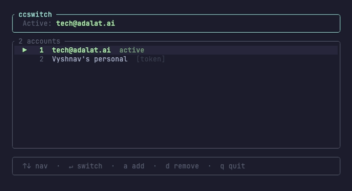

# ccswitch

Switch between multiple Claude Code accounts instantly — no logging in and out.



---

## Why

Claude Code only holds one account at a time. Switching meant logging out, waiting for the browser flow, and losing your session. With multiple accounts — work, personal, multiple team seats — this gets painful fast.

ccswitch snapshots each account's credentials to the system keychain, then swaps them in one command. Claude Code just sees a clean account on restart.

It also handles the `claude setup-token` (long-lived token) path, where `CLAUDE_CODE_OAUTH_TOKEN` silently overrides the credentials file and makes plain credential-swapping invisible.

---

## Install

**Requires:** Rust toolchain (`curl https://sh.rustup.rs | sh`)

```bash
cargo install --git https://github.com/vyshnavsdeepak/ccswitch
```

Or from source:

```bash
git clone https://github.com/vyshnavsdeepak/ccswitch
cd ccswitch
cargo install --path .
```

---

## Quick start

### OAuth accounts (browser login)

```bash
# 1. Log in to your first account in Claude Code, then:
ccswitch add          # snapshots credentials → Account 1

# 2. Log out, log in to your second account, then:
ccswitch add          # snapshots credentials → Account 2

# 3. Switch any time:
ccswitch switch 1     # switch to Account 1
ccswitch switch 2     # switch to Account 2
ccswitch switch       # rotate to the next account

# 4. Restart Claude Code to apply.
```

### Token accounts (`claude setup-token`)

```bash
# 1. Make sure CLAUDE_CODE_OAUTH_TOKEN is set in your shell, then:
ccswitch add
# → reads the token from $CLAUDE_CODE_OAUTH_TOKEN automatically
# → prompts for an email/label (e.g. work@company.com)
# → on first add, prints a one-time setup instruction:

#   Add to ~/.zshrc:  source ~/.ccswitchrc
#   Then open a new terminal.

# 2. Add more token accounts by setting a different token and re-running:
CLAUDE_CODE_OAUTH_TOKEN=sk-ant-... ccswitch add

# 3. Switch:
ccswitch switch 2
# → updates the active token + opens new shell for it to take effect
```

After the one-time `source ~/.ccswitchrc` in your shell profile, ccswitch manages `CLAUDE_CODE_OAUTH_TOKEN` on every switch automatically. `~/.zshrc` is never touched again.

---

## Commands

```
ccswitch                    open interactive TUI (recommended)
ccswitch add                add current / $CLAUDE_CODE_OAUTH_TOKEN account
ccswitch list               list all managed accounts
ccswitch status             show which account is active
ccswitch switch [n|email]   switch to account n or by email; rotates if omitted
ccswitch remove [n|email]   remove account n or by email
```

`switch` and `remove` accept either the account number or the full email address:

```bash
ccswitch switch 2
ccswitch switch work@company.com
ccswitch remove personal@gmail.com
```

---

## TUI

Run `ccswitch` with no arguments for the full interactive interface.

```
╭─ ccswitch ───────────────────────────────╮
│  Active: work@company.com                │
╰──────────────────────────────────────────╯
╭─ 3 accounts ─────────────────────────────╮
│  ▶   1  work@company.com       active    │
│      2  personal@gmail.com               │
│      3  team@startup.ai  [token]         │
╰──────────────────────────────────────────╯
╭──────────────────────────────────────────╮
│  ↑↓ nav  ·  ↵ switch  ·  a add  ·  q quit│
╰──────────────────────────────────────────╯
```

| Key | Action |
|-----|--------|
| `↑ / k` | move up |
| `↓ / j` | move down |
| `Enter / Space` | switch to selected account |
| `a` | add current account |
| `d / Delete` | remove selected account |
| `q / Esc` | quit |

Token accounts show a dim `[token]` badge. After switching to a token account, the Done banner reminds you to open a new shell (so `CLAUDE_CODE_OAUTH_TOKEN` updates).

---

## After switching

| Account type | What to do |
|---|---|
| OAuth | Restart Claude Code |
| Token | Restart Claude Code **and** open a new terminal |

The new terminal picks up the updated `CLAUDE_CODE_OAUTH_TOKEN` sourced from `~/.ccswitchrc`.

---

## How `~/.ccswitchrc` works

On first token account add, ccswitch writes a small file:

```bash
# Managed by ccswitch — do not edit manually
export CLAUDE_CODE_OAUTH_TOKEN=$(security find-generic-password -s "ccswitch-active-token" -w 2>/dev/null)
```

This file **never changes**. On every switch, ccswitch updates the `ccswitch-active-token` keychain entry it reads from. Source the file once in `~/.zshrc` and you're done.

---

## Security

- **macOS:** all credentials stored in the system keychain via `security(1)` — no plaintext secrets on disk.
- **Linux/WSL:** per-account credential files under `~/.claude-switch-backup/credentials/` with `0600` permissions; directory is `0700`.
- All file writes are atomic (write to temp → rename) to prevent corruption on crash.
- `~/.ccswitchrc` contains a lookup command, not the raw token.

---

## File layout

```
~/.claude-switch-backup/
├── sequence.json              # account list and active state
├── configs/
│   └── .claude-config-1-email@example.com.json   # per-account Claude config
└── credentials/               # Linux/WSL only (macOS uses keychain)
    └── .claude-credentials-1-email@example.com.json
~/.ccswitchrc                  # token env var loader (token accounts only)
```

---

## Platforms

| Platform | Credential store |
|----------|-----------------|
| macOS | system keychain (`security add-generic-password`) |
| Linux | `~/.claude-switch-backup/credentials/` (mode 0600) |
| WSL | same as Linux |
